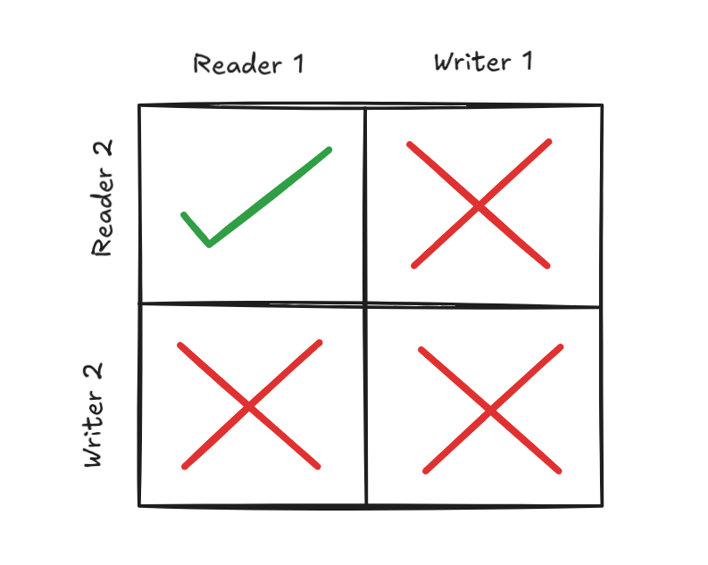

A buffer pool manager is an indirection layer that sits between the execution layer *(query executor)* of the query and the data layer *(disk manager)*. It's an indirection layer that not only acts as an indirection but also as an abstraction that offers the undisputable benefit of caching with appropriate cache eviction policy. Having a single layer for fetching page data also makes it easier to handle certain concurrency related problems

## Things that a useful Buffer Pool Manager brings to the table

A Buffer Pool must adhere to some of the following conditions:
- Any basic buffer pool manager **(BFPM)** should allow us to fetch page data *(usually as unsigned char[PAGE_SIZE])* given a page id. 

- Any thread that fetches the page data should also be responsible for informing the **BFPM** once it has finished using the page data. This is to release the **READ LATCH** on the page data

- There should be a way for a thread to let the **BFPM** know that it needs to modify the contents of a page (**WRITE LATCH**). 

- A **BFPM** should also contain an implicit eviction manager which releases the memory occupied by **Cold Pages** (or) pages that the buffer pool manager assumes, will not be used in the near future. This is done to make memory available for other pages that might need to be used for processing running queries.

- Consistency should be handled in concurrent workloads properly using the **READ** and **WRITE** Latches.

```cpp
enum LatchType {
    READ_LATCH,
    WRITE_LATCH
};

class BufferPoolManager {

    class EvictionManager {
        void updateAccess(int pageId);
        void evictPage();
    }

    unsigned char* getPage(int pageId, LatchType lt);
    void releasePage(int pageId);
    bool upgradeLatch(int pageId);
    void flush(int pageId);
    EvictionManager em;
};
```

The methods defined by the skeleton of the BufferPoolManager is synchronous to the requirements of a buffer pool manager listed above. 

## Necessary Data Structures

The above class is a skeleton for implementing a **BFPM** and it enumerates the APIs the user of the **BFPM** will call in terms of methods. But we're yet to really look into the internal workings of the Buffer Pool Manager. While the skeleton is algorithm agnostic and high level, any note on a buffer pool manager should discuss about the specifics of the algorithm that powers the **BFPM** and the data structures required to do so.

*Note: I want to implement a generic Buffer Pool Manager with as much modularity as possible (For Extension) so I will not be using any sohphisticated algorithms for cache eviction and whatnot.*

### Page Data Map

This is a hashmap that returns the page data given a page id. But it returns the address to the actual data in memory.

### Access Order Recorder

This is a linked hashmap stored and used by the **Eviction Manager** to identify the least recently used page. yep...I am going to be using simple Least Recently Used eviction policy for evicting pages at times of memory scarcity.

There's a catch. The Eviction Manager simply cannot remove the least recently used page and be done with it. This is because I haven't talked about how modified pages will be flushed to the disk. I was thinking I'd flush the dirty pages to disk asynchronously using a schedule rather than perform them during the write operation *(This way, I could potentially batch I/O)*. So the eviction manager will find the first undirty page that has been least recently used.


### Buffer Pool Frame

Since we're talking about dirty pages, How do I differentiate between pages that have been modified and pages that have not? Let's introduce a **isDirty** Flag and store it along with the page data. Now our buffer pool class looks like this:

```cpp
//Ignoring the memeber functions
class BufferPoolFrame {
    int pageId;
    unsigned char* data;
    bool isDirty;
};

class BufferPoolManager {
    ConcurrentHashMap<int, BufferPoolFrame*> pageDataMap;
    class EvictionManager {
        LinkedHashMap<int, BufferPoolFrame*> accessOrderMap;
    }
};
```

A periodic scheduler will run and flush the dirty pages to disk. This scheduler will be instantiated in a separate thread as soon as the buffer pool manager object is created *(As of now, for a lack of a better design philosophy)*

## The Ingredient For Concurrency

Now that we've done with the functionality bits of the **BFPM**, let's handle concurrency issues and race conditions. To be honest, functionality of a **BFPM** is not prone to any race conditions but I wanted to handle this problem separately. It always becomes a mess when we try to design a solution for both functionality and concurrency at the same time.

We need to use the **READ** and **WRITE** latches that we talked about earlier. Here are the conditions that need to be guaranteed for safe execution:



1. There can be multiple threads with a read latch on a page assuming there's no thread holding a write latch on the page.

2. There can only be one thread at a time that has the write lock on the page and no other thread is allowed to hold either read or write lock on the page until the thread holding the write lock *(first thread)* releases it.

### So How do we implement this conditions ?

SharedMutex to the rescue. We simply include the shared mutex for every pageFrame.

```cpp
class BufferPoolFrame {
    int pageId;
    unsigned char* data;
    bool isDirty;
    std::shared_mutex _pageMtx;
};
```

Now a reader thread has to acquire a read lock on the mutex and a writer thread has to acquire a write lock on the mutex and all the heavy lifting will be done by these mutexes.

But there's an inherent problem with C++ standard shared mutexes: A thread holding a shared lock (read lock) on a shared mutex can't really upgrade to an exclusive lock (write lock) without releasing the existing lock. This creates a time frame for race conditions and a bunch of problems, consequently. I have addressed this problem by rolling out my own [readerWriterLock](https://ashwinhprasad.medium.com/implementing-a-read-write-lock-in-c-79f76894ded3?source=friends_link&sk=dd3c480b2759e57a07318c4f3fb56001)

Rewriting the class, again:
```cpp
class BufferPoolFrame {
    int pageId;
    unsigned char* data;
    bool isDirty;
    ReaderWriterLock _pgLck;
};
```

One more minor detail I have missed to address is that the eviction manager simply cannot evict the least recently used page without ensuring that the page is not being referenced by any thread. For ensuring this, the evition manager can indeed try to get a write lock on the page. But why invoke a kernel call for this when an additional variable is all we need.

```cpp
class BufferPoolFrame {
    int pageId;
    unsigned char* data;
    bool isDirty;
    ReaderWriterLock _pgLck;
    std::atomic<int> refCounter(0);
};
```

Whenever a thread utilises a page data, the *refCounter* will be incremented and it will again be decremented when the thread is done with it. The eviction manager will only evict those pages that have a *refCount* of 0.


## A Final Description of the main methods

1. ```BufferPoolManager.getPage(int pageId, LatchType lt)```: 

Given a page id, checks if the page exists in the **Page Data Map**. If the page is not present there, adds it to the map via a call to the disk manager. Acquires a shared lock or exclusive lock based on the page, increments the refCounter and returns a reference to the page data. If lock acquisition is not possible due to some other thread, waits for *x* milliseconds and tries again until the lock is acquired.


2. ```BufferPoolManager.releasePage(int pageId)```: 

Unlocks the ReaderWriter lock on the buffer pool frame corresponding to the page id. Decreases the refCount whild doing so.

3. ```BufferPoolManager.upgradeLatch(int pageId)```:

Tries to upgrade the ReaderWriter lock from a reader lock to a writer lock. If successful, returns true. If fails, returns false. The Caller will decide what to do in case of failure.


4. ```BufferPoolManager.flush(int pageId)```:

Writes the page from in-memory to disk using the disk manager, then updates the isDirty flag to false. Usually used by the periodic scheduler *(flusher)*

5. ```EvictionManager.updateAccess(int pageId)```:

The Eviction Manager contains an ordered hashmap which internall contains a doubly linked list. The nodes of the doubly linked list will be re-arranged such that the page id, being accessed will be removed from internal node and added to the tail of the doubly linked list.

This will make the head of the doubly linked list the least recently accessed element.

6. ```EvictionManager.evictPage()```:

When there isn't enough memory for a new page addition, the least recently used page which is not dirty and not being used currently will be removed from the **Page Data Map** and removed from the heap memory. This will be done by the eviction manager.

## Wrapping Up

The Buffer Pool Manager is a very necessary component of any database engine. The centralized architecture for communication between the disk layer and the query execution layer makes it easy to handle issues like concurrency and cache eviction in a modular way.

This is not C++ 101 so I'll refrain from bloating this post with the entire code. The complete code will be available [here](https://link-will0be-added/com).

I hope I haven't missed anything here. If you find any errors here, let me know.