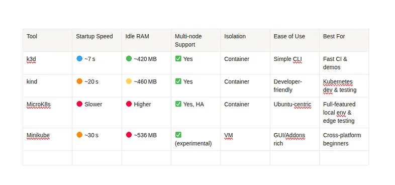
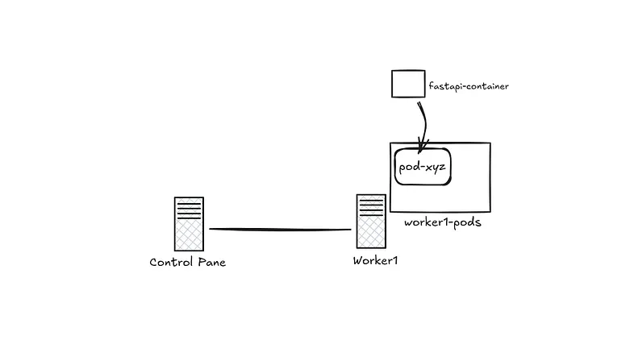

Kubernetes is a container orchestration platform used to deploy and manage auto-scaling, stateless application server containers, as well as maintain clusters of stateful, replicated components.

Without Kubernetes, managing containerized applications at scale would be significantly more complex and time-consuming. Developers and operators would need to manually handle tasks like container deployment, load balancing, scaling, and failure recovery across multiple servers. Ensuring high availability, rolling updates, and efficient resource utilization would require custom scripts and constant monitoring, increasing the risk of errors and downtime. In short, without Kubernetes, maintaining reliability and scalability in a modern microservices architecture would be far more difficult and less efficient.

We’ll explore the key advantages of Kubernetes more clearly as the series progresses.

# Let’s get started with the installation.

Kubectl is the command line tool used to interact with kubernetes clusters.

**1. Download Kubectl**

```sh
curl -LO "https://dl.k8s.io/release/$(curl -L -s https://dl.k8s.io/release/stable.txt)/bin/linux/amd64/kubectl"
```

**2. Install Kubectl**

```sh
sudo install -o root -g root -m 0755 kubectl /usr/local/bin/kubectl
```

For complete installation manual for kubectl, refer here . Once done, Verify the installation by typing `kubectl` in the terminal

# Setting up a local kubernetes playground

Kubernetes allows deploying pods *(terms can be used interchangeably with container as of now)* onto a cluster of machines and allows configurations of number of pods to be run, for each type of pod. It also allows auto-scaling of pods across multiple containers depending upon metrics like RAM usage, CPU usage. To test and play with kubernetes without having a cluster of machines, we can simulate the environment of having multiple machine instances. Mini-kube, Kind, K3D, MicroK8s are all tools that help simulate such an environment.

I did a little bit of research and evaluated the different playgrounds. Here are my findings.



Based on the above results, k3d seems to be the best option to start with, at the moment.

# Install k3d

```sh
curl -s https://raw.githubusercontent.com/k3d-io/k3d/main/install.sh | bash
```

Verify the installation once by typing ‘k3d’ from terminal

# Deploying a simple application

I think the best way to learn and get around the concepts of kubernetes is to *“just build, deploy and manage”* stuff with it.

I am planning to deploy a simple `FastAPI` application and later add a very simple database instance (probably `PostgreSQL`) with kubernetes.

## Writing a simple FastAPI Application

```python
# main.py
from fastapi import FastAPI
import random

app = FastAPI()

@app.get("/")
def get_random_number():
    return {"number": random.randint(1, 100)}
```

The below are the python library requirements for the above program.

```txt
# requirements.txt
fastapi
uvicorn[standard]
```

## Dockerizing the Application

```dockerfile
# Dockerfile
FROM python:3.9-slim

ENV PYTHONDONTWRITEBYTECODE=1
ENV PYTHONUNBUFFERED=1

RUN apt-get update && apt-get install -y build-essential

WORKDIR /app

COPY requirements.txt .
RUN pip install --no-cache-dir -r requirements.txt

COPY main.py .

EXPOSE 80

CMD ["uvicorn", "main:app", "--host", "0.0.0.0", "--port", "3000"]
```

To create the docker image based on the above Dockerfile, use the following command:

```sh
docker build -t fastapi-random:latest .
```

## Creating a K3Ds cluster

```sh
k3d cluster create simple-app-cluster --servers 1 --agents 1
```

the --servers argument is optional above since K3D will by default configure a control plane node, unless explicitly specified not to.

The cluster is created but how do we tell kubectl to interact with the master-plane of this particular cluster. For this, we need to set kubectl context but K3D automates this by setting the kubectl context to point to the newly spawned up cluster automatically.

This can be verified by:

```sh
kubectl config get-contexts
```

On creating a K3D cluster, you can notice that 3 containers are spun up on your machine.

```sh
docker ps

# Output
#CONTAINER ID   IMAGE                            COMMAND                  CREATED        STATUS       PORTS                                         NAMES
#103db62fe031   ghcr.io/k3d-io/k3d-proxy:5.8.3   "/bin/sh -c nginx-pr…"   20 hours ago   Up 9 hours   80/tcp, 0.0.0.0:40917->6443/tcp               k3d-simple-app-cluster-serverlb
#bb5c4b578e8d   rancher/k3s:v1.31.5-k3s1         "/bin/k3d-entrypoint…"   20 hours ago   Up 9 hours                                                 k3d-simple-app-cluster-agent-0
#96cfcbe1cacf   rancher/k3s:v1.31.5-k3s1         "/bin/k3d-entrypoint…"   20 hours ago   Up 9 hours                                                 k3d-simple-app-cluster-server-0
```

The server-0 (control-plane) and the agent-0 (worker node) are self explanatory, but what’s this serverlb ? the load balancer acts as the gateway to interact with the API server in the control plane(s). This is helpful in situations where we might want to create multiple control plane nodes.

### Other cluster operations

If we decide to stop, restart and delete the cluster:

```sh
k3d cluster stop simple-app-cluster
k3d cluster start simple-app-cluster
k3d cluster delete simple-app-cluster
```

## Writing the first deployment

Now that we have a single node cluster set up and the dockerized FastAPI application ready, it is time to deploy the FastAPI application to the cluster.

```yaml
# fastapi-deployment.yaml
apiVersion: apps/v1
kind: Deployment
metadata:
  name: fastapi-app
spec:
  replicas: 1
  selector:
    matchLabels:
      app: fastapi
  template:
    metadata:
      labels:
        app: fastapi
    spec:
      containers:
        - name: fastapi
          image: fastapi-random:latest
          imagePullPolicy: IfNotPresent
          ports:
            - containerPort: 3000
---
apiVersion: v1
kind: Service
metadata:
  name: fastapi-service
spec:
  selector:
    app: fastapi
  ports:
    - protocol: TCP
      port: 3000
      targetPort: 3000
      nodePort: 30080
  type: NodePort
```

Before we deploy this deployment, we need to ensure that our image created from the above dockerfile is available for K3D.

The above fastapi-deployment.yaml contains the configurations of the kubernetes deployment and service objects.

#### Deployment

Kubernetes deployment objects provides a declarative way to instruct kubernetes to control and manage the state of pods, such as number of replicas and it’s scaling constraints. The Deployment controller then creates and updates the pods to match the desired state *(Based on the declared config in the yaml files)*, handling scaling and self-healing in the process. This allows for rolling updates and rollbacks, making it easier to manage application deployments.

#### Services

What kubernetes deployments do for state of pods, services do for network identities for the deployed entities. Services exposes the pods to the network and routes traffic to them, allowing other components to access the application without knowing the pod’s IP address. There are also different kinds of services support such as ClusterIP, NodePort, and LoadBalancer, making it flexible to expose applications.

---

Let’s go through the `fastapi-deplyment.yaml` in detail.

We have defined 2 kubernetes resources in the above yaml config namely, deployment and service.


#### Deployment

The **apiVersion**, kind, and metadata are pretty self-explanatory. The actual configuration of the deployment lies in the spec.

Spec stands for specification and in kubernetes, it describes the desired state of the resource.

```yaml
spec:
  replicas: 1
  selector:
    matchLabels:
      app: fastapi
```

The above is our way of telling kubernetes *“Hey, I want exactly 1 replica of a pod that is labeled app: fastapi, and I want the Deployment to manage it”*

```yaml
template:
    metadata:
      labels:
        app: fastapi
    spec:
      containers:
        - name: fastapi
          image: fastapi-random:latest
          imagePullPolicy: IfNotPresent
          ports:
            - containerPort: 3000
```

Templates are the blueprint for creating new pods. Here we have provided the basic docker image, exposed ports and some other information to create a new pod. We are asking kubernetes to *“I want 1 pod with label app: fastapi running at all times, and if there isn’t one, use this template to create one.”*

*Note: Make sure to use the imagePullPolicy: IfNotPresent. This will make sure to check the presence of the image locally (in k3d cluster) before trying to pull the image from the central docker hub.*

#### Service

**Pods come and go, Services stay forever**

The concept of a pod in kubernetes is very volatile. It can be spawned up or destroyed without any identity retention. But we do need some sort of network identity if we have to enable communication between pods or expose our pods to external entities outside the network. This is where services comes in. It provides a stable network identifier to pods even if the pods being encompassed are spawned and destroyed indefinitely.

There are many types of services in kubernetes:

- NodePort
- LoadBalancer
- ClusterIP (default)
- ExternalName

I will document each of them deeply in the future. But the main objective that remains now is to deploy the created image as containers inside kubernetes pods.

```yaml
apiVersion: v1
kind: Service
metadata:
  name: fastapi-service
spec:
  selector:
    app: fastapi
  ports:
    - protocol: TCP
      port: 3000
      targetPort: 3000
      nodePort: 30080
  type: NodePort
```

Since I only have 1 replica of the fastapi-app currently, a nodePort service is more than enough.

- **targetPort: 3000** — This is the port on the container (Pod) that the request is actually forwarded to. t represents the application’s port, i.e., where your FastAPI app is listening inside the Pod. When the Service gets a request on port: 3000, it forwards it to targetPort: 3000 on the selected Pod.

- **nodePort: 30080** — This is the port exposed on every Node’s IP for external traffic. It allows you to access your application from outside the cluster.

- **port: 3000** — It’s the port that other components inside the cluster use to access the service via its name (fastapi-service). Example: curl http://fastapi-service:3000

## Let's Deploy

Before we apply the deployment, we need to make sure our fastapi docker image is available in the k3d cluster. So, Let’s import the docker image into the k3d cluster using:

```sh
k3d image import fastapi-random:latest -c simple-app-cluster
```

Once imported into the k3d cluster, you can check if the image exists inside the k3d cluster using the following commands

```sh
docker ps # you will see a container for each node in the k3d cluster

docker exec k3d-simple-app-cluster-agent-0 crictl images | grep fastapi-random # This will return the image inside the k3d node
# If the name is prefixed with 'docker.io/library/', do not worry. When Kubernetes can't find an image with a short name like fastapi-random:latest, it automatically tries to pull it from the default registry (docker.io/library/).
```

Finally, Apply the deployment:

```sh
kubectl apply -f fastapi-deployment.yaml
```

Now you should be able to access the fastapi application from one of the node’s IP from the cluster. <node-ip>:30080.

To get the node IP,

```sh
kubectl get nodes -o wide #Get Node IP from INTERNAL IP column
```

Now the application should be accessible from the browser at <node-port>:30080



# What's Next ?

In the next section, we’ll scale the deployment across multiple pods and nodes.