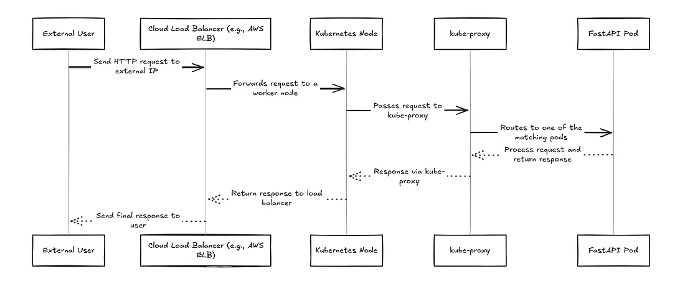

In the previous [post](./kubernetes-1), we saw about installing kubectl and setting up a basic FastAPI application in a single node k3d cluster. let’s improve upon it. Let’s deploy multiple pods of our FastAPI application to ensure higher availability and balance load across these pods and nodes.

# Understanding the Load-Balancer Service

When there are multiple pods for a single service, distributed across multiple nodes, we need a mechanism that allows users to send requests to a single external IP address. These requests must then be load balanced to the appropriate node and pod. However, the LoadBalancer service doesn’t do this alone. It relies on external cloud load balancers and a Kubernetes component called kube-proxy to distribute the traffic efficiently.

## Role of Load Balancers in Cloud Providers

When running Kubernetes in a cloud environment (like AWS, GCP, or Azure), a LoadBalancer service type in Kubernetes triggers the cloud provider to provision an external load balancer. The Cloud Controller Manager is the bridge between Kubernetes and your cloud provider. It runs as a pod in your cluster and watches for LoadBalancer services. When the CCM detects a new LoadBalancer service, it gathers node information and marks these nodes as targets for the cloud provider’s load balancer.

Let’s walk through what happens when a user sends a request to your FastAPI app.

## Request Flow: From User to Application

Let’s walk through what happens when a user sends a request to your FastAPI app:



When a user sends a request to your FastAPI application running on Kubernetes, here’s what happens:

### 1. User Sends Request

The user hits your app’s external web address *(provided by your cloud provider’s load balancer)*.

### 2. Cloud Load Balancer Distributes Traffic

The cloud provider’s load balancer receives the request and forwards it to one of your healthy Kubernetes nodes via the port exposed through a backend NodePort service *(assume this is using a simple round-robin approach)*.

### 3. Kube-Proxy Routes to Your App

When the request reaches a Kubernetes node through the exposed NodePort, **kube-proxy** plays a key role in routing the traffic to one of your application pods *(e.g., a FastAPI instance)*. Here’s how it works under the hood:

- kube-proxy monitors Kubernetes Services and endpoints, and dynamically updates the node’s iptables (or IPVS, depending on the mode) rules accordingly.
- These rules act as a kind of “traffic map” that tells the Linux kernel how to handle incoming packets addressed to a service.
- Once the request hits a node, the Linux kernel uses these iptables rules to redirect the traffic to a healthy pod backing the service.
- The selected pod might be on the same node or on a different node. If it’s on a different node, kube-proxy (via iptables) ensures the request is forwarded across the cluster network to the appropriate destination pod.

**Important Note:** kube-proxy does not handle the traffic itself. It simply sets up the rules; the actual packet forwarding is done by the Linux kernel, making this process efficient and low-latency.


### 4. Your FastAPI App Processes the Request

The selected FastAPI pod handles the request and sends back a response.

### 5. Response Returns to User

The response travels back through the same path: FastAPI pod → Cloud Load Balancer → User

## Load Balancers in K3D Clusters


**The Challenge with Local Development:** When developing Kubernetes applications locally using K3D *(Kubernetes in Docker)*, you face a significant limitation: there’s no cloud provider to provision external load balancers. Unlike managed Kubernetes services *(EKS, GKE, AKS)*, K3D runs entirely on your local machine without access to cloud infrastructure.

In a K3D cluster, when you create a LoadBalancer service:

1. **No External IP Assignment:** The service remains in a “Pending” state indefinitely
2. **No Traffic Routing:** External requests can’t reach your application
3. **Limited Testing:** You can’t properly test load balancing behavior locally
4. **Development Friction:** Developers must use port-forwarding or NodePort services as workarounds

To overcome these limitations, we are going to use a pre-existing bare metal load balaner called [MetalLB](https://metallb.io/).

```sh
# This will show <pending> forever in K3D without MetalLB
kubectl get svc my-app
NAME     TYPE           CLUSTER-IP     EXTERNAL-IP   PORT(S)        AGE
my-app   LoadBalancer   10.43.123.45   <pending>     80:30123/TCP   5m
```

## How MetalLB Works in K3D for Local Development


MetalLB provides an elegant solution for local development by simulating cloud-like LoadBalancer functionality in a K3D cluster. Unlike cloud-managed Kubernetes clusters, where LoadBalancer services automatically receive external IPs, local clusters typically lack this feature. MetalLB bridges this gap by managing a predefined pool of IP addresses and dynamically assigning them to LoadBalancer services. When a service is deployed, MetalLB automatically selects an available IP from its pool and ensures that traffic reaching this IP is properly routed into the cluster into one of the nodes.

Once an IP is assigned, MetalLB takes on the responsibility of advertising it on the local network. This makes services accessible from outside the cluster, just as they would be in a cloud environment.

### Request Flow in K3D with MetalLB

When a user sends a request to the MetalLB-assigned IP, the traffic flows through a well-defined path.

- **MetalLB announces the IP via Address Resolution Protocol (ARP)**, associating it with the MAC address of one of the K3D worker nodes. As a result, the request is sent directly to that node by the client.

- From there, kube-proxy takes over, using its internal networking and service discovery mechanisms to route the request to an available FastAPI pod (or any other application pod).

-The pod processes the request, and the response follows the reverse path, going back to the client.

This seamless flow ensures that developers can test LoadBalancer services locally without needing a cloud provider. MetalLB effectively mimics the behavior of cloud-based Kubernetes clusters, making it an essential tool for realistic local development and testing. The result is a smooth, production-like experience while working in a lightweight, containerized environment.

## Getting started with the Implementation

### Step 1: Create a Multi-Node k3d Cluster


Let’s spin up a Kubernetes cluster with 1 server (control plane) and 2 worker nodes (agents).

```sh
k3d cluster create simple-app-cluster \
  --servers 1 \
  --agents 2
```

### Step 2: Install MetalLB (LoadBalancer for Local Clusters)

MetalLB lets us simulate a cloud-style LoadBalancer service on bare metal (or Docker networks, in this case).

```sh
kubectl apply -f https://raw.githubusercontent.com/metallb/metallb/v0.15.2/config/manifests/metallb-native.yaml
```

Refer to MetalLB’s official documentation for this. Once installed, wait for MetalLB to be ready

```sh
kubectl wait --namespace metallb-system \
  --for=condition=ready pod \
  --selector=app=metallb \
  --timeout=90s
```

### Step 3: Configure IP Range for MetalLB

MetalLB needs a pool of IPs it can hand out. These IPs must be within your Docker network range.

```sh
docker network inspect k3d-simple-app-cluster
```

Look for the Subnet field under "IPAM". It might look something like this: “Subnet”: “172.20.0.0/16”

Pick a range inside this subnet (not overlapping with existing addresses). For example: 172.20.255.200–172.20.255.250

**Create a MetalLB Config File:**

```yaml
apiVersion: metallb.io/v1beta1
kind: IPAddressPool
metadata:
  name: first-pool
  namespace: metallb-system
spec:
  addresses:
  - 172.20.255.200-172.20.255.250
---
apiVersion: metallb.io/v1beta1
kind: L2Advertisement
metadata:
  name: example
  namespace: metallb-system
spec:
  ipAddressPools:
  - first-pool
```

**Apply the Config**

```sh
kubectl apply -f metallb-config.yaml
```

### Step 4: Build and Import Your FastAPI App Image
This is the same as what we did in the first post. Build and import the docker image inside the k3d cluster.

```sh
docker build -t fastapi-random:latest .

k3d image import fastapi-random:latest -c simple-app-cluster
```

### Step 5: Deploy the FastAPI App with 3 Replicas

Let’s update the earlier fastapi-deployment.yaml file from the previous post. The below is the changes I am making


```diff
apiVersion: apps/v1
kind: Deployment
metadata:
  name: fastapi-app
spec:
- replicas: 1
+ replicas: 3
  selector:
    matchLabels:
      app: fastapi
apiVersion: v1
kind: Service
metadata:
  name: fastapi-service
spec:
  selector:
    app: fastapi
  ports:
-   - protocol: TCP
-     port: 3000
-     targetPort: 3000
-     nodePort: 30080
- type: NodePort
+   - protocol: TCP
+     port: 80
+     targetPort: 3000
+ type: LoadBalancer
```

The above are the diffs of deployment and service configs from the previous post. With this, we will be deploying 3 pods of the fastapi application in our k3d cluster and use a load balancer service to route traffic to them.

```sh
kubectl apply -f your-fastapi-deployment.yaml
```

### Step 6: Access the application

In order to access the application, we finally have to get the IP address of the external load balancer that was advertised by MetalLB. This can be done by:

```sh
kubectl get svc fastapi-service

# Output
# NAME              TYPE           CLUSTER-IP      EXTERNAL-IP      PORT(S)        AGE
# fastapi-service   LoadBalancer   10.43.135.142   172.20.255.201   80:30124/TCP   5h43m
```
Open the browser and access the link http://172.20.255.201 or whatever IP address you get in the External IP column.